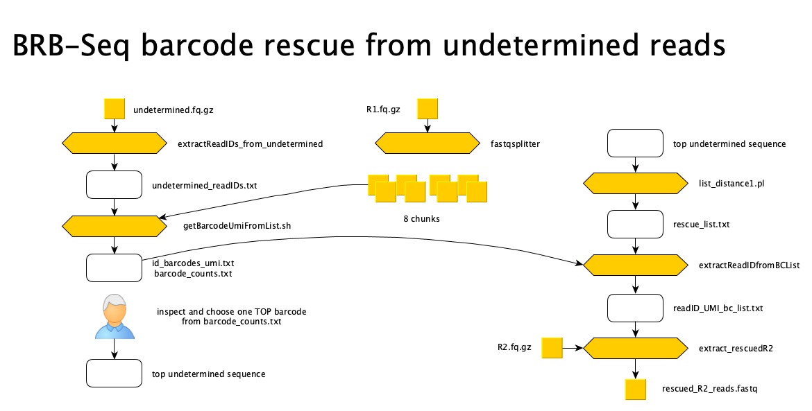

[(Nucleomics-VIB)](https://github.com/Nucleomics-VIB)
 - BRBSeq-Tools
==========

*All tools presented below have only been tested by me and may contain bugs, please let me know if you find some. Each tool relies on dependencies normally listed at the top of the code (cpan for perl and cran for R will help you add them)*

<h4>Please send comments and feedback to <a href="mailto:nucleomics.bioinformatics@vib.be">nucleomics.bioinformatics@vib.be</a></h4>

## Process BRB-Seq data obtained from the Aviti instrument

### Plot distance between barcodes used in one experiment to identify small-distance pairs

* BRB_distance2.R


The code can be tuned to color the distance in different ways, see script for details


As seen in the last plot, the minimal distance between non-identical barcodes is 4 (4 base substitutions) and should allow unambiguous demultiplexing.

### Get all variant barcodes with a distance of 1 from a user provided sequence

* list_distance1.pl

This utility takes one barcode as input and outputs it together with all single nucleotide variants (only substitutions). The output can be used to rescue reads from the undetermined fastq file after identifying them from the R1 file (done below)

### Case-Study: Rescue barcode data from an aviti BRB-Seq run

A BRB-Seq run ended up with one sample having significantly less reads than the others

```
Demultiplexing Summary
Summary Nb_Reads        Percent
Total number of reads   1038831779      100
Undetermined Barcodes   17796238        1.71
Determined Barcodes     1021035541      98.29
```

One barcode (6607:AACAACCGAAGTAA) was giving too few reads and we thought that the corresponding barcode sequence (provided by the customer in Exp4632_barcodes.txt) could have been the problem.

We processed the data as follows:



The top barcode sequence identified from R1 sequences based on readIDs found in the undetermined fastq file are listed next.

```
CAATGCATTTCACC  467885
ACGGCCTTCAAAGT  205942
ATTCCTTTAAGTTT  151154
TCCAGCACCGGGCA  117733
TGTCTCTTATACAC  88274
CCTGTCTCTTATAC  87799
GTCTCTTATACACA  79008
ATACCTGTCTCTTA  78839
CTCCTAACACCTGT  67332
ATAATATCTGTCTC  63756
```

The readIDs of the top over-represented barcode CAATGCATTTCACC (N=467885) and its distance-1 relatives (obtained from ```list_distance1.pl CAATGCATTTCACC```) were used to extract UMI and barcode information from the R1 fastq file, and to recover R2 reads with matching readID names.
During rescue, the UMI and barcode were added to the extracted read headers before writing them to file (separated by '+').

The bioawk driven custom bash functions used for this analysis are found in scripts/ (txt files with name starting with 'fun')

* **extractReadIDs_from_undetermined**: writes the full list of readIDs found in the undetermined fastq file

* use **[fastqsplitter](https://github.com/LUMC/fastqsplitter)** to split R1 reads in 8 chunks to be used in parallel (**fastqsplit.sh**)

* **getBarcodeUmiFromList.sh**: parse the R1 reads chunks and for each undetermined readID print out the readID, barcode and umi to a text file (**id_barcodes_umi.txt**)
  
* parse id_barcodes_umi.txt and count unique barcodes. Identify the top represented barcode, produce its distance-1 variants with **list_distance1.pl** (**rescue_list.txt**)

* **extract_rescuelist**: extract readID, UMI and barcode from **id_barcodes_umi.txt** for all barcodes in the **rescue_list.txt**
  
* **extract_rescuedR2**: using **rescue_list.txt**, parse the R2 reads, identify readIDs from the list and add the UMI and barcode to their header before writing them to a new fastq file

The results of the final extraction were parsed to count the combinations of UMI and barcodes shown below (top-10)

```
 460922 GCTCCACCGGAAAT  CAATGCATTTCACC
   9442 GCTCCACCGGAAAT  CAGTGCATTTCACC
   7171 GCTCCACCGGAAAT  TAATGCATTTCACC
   6780 GCTCCACCGGAAAT  CAAGGCATTTCACC
   2845 GCTCCACCGGAAAT  CCATGCATTTCACC
   1187 GCTCCACCGGAAAT  CAACGCATTTCACC
   1136 GCTCCACCGGCAAT  CAATGCATTTCACC
    761 GCTCCACCGGAAAT  CTATGCATTTCACC
    565 TGTCTCTTATACAC  CAATGCATTTCACC
    468 GCTCCACCGGGAAT  CAATGCATTTCACC
```

After performing the analysis we found too few sequences associated with the top undetermined barcode to represent a full missing barcode read group (other read groups returned 10M reads in average).

Furthermore, as seen a large majority of the rescued reads (460922/500025) have the same UMI GCTCCACCGGAAAT and the target barcode CAATGCATTTCACC.

Finding the same UMI in so many reads was not expected and suggests that these reads are artefacts and report as UMI some sequence originating from the sequencing adaptors.

It is therefore likely that the minor sample found in this run does not represent a wrong barcode sequence provided by the customer but rather a failed library prep for the corresponding sample due to input quality of the DNA or human error.

The code is provided here to be recycled for other purpose.

<hr>


This work is licensed under a [Creative Commons Attribution-ShareAlike 3.0 Unported License](http://creativecommons.org/licenses/by-sa/3.0/).

